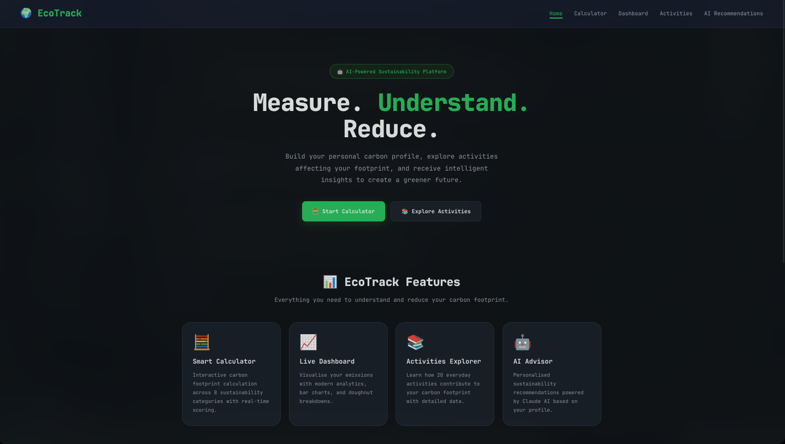
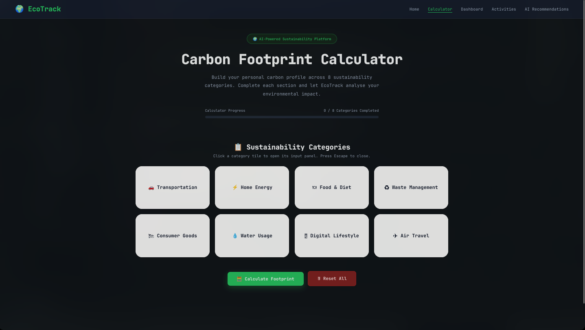
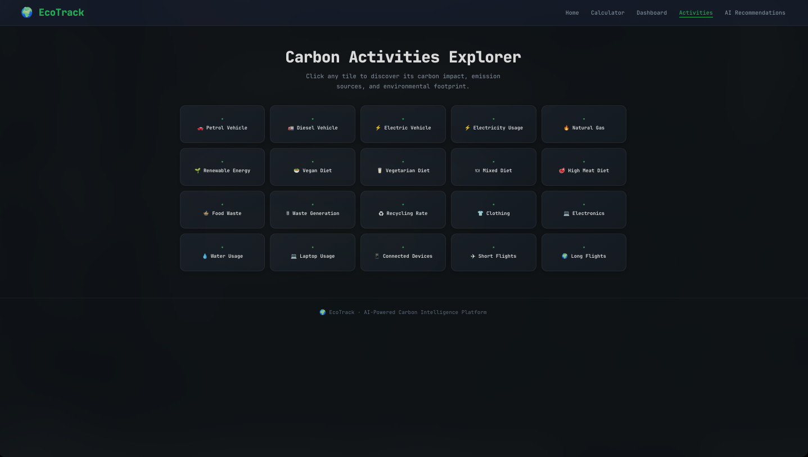

# 🌍 EcoTrack
### AI-Powered Carbon Intelligence Platform

## 🌟 Overview

EcoTrack is a fully client-side, zero-dependency web application that helps
individuals **understand, calculate, and reduce** their personal carbon footprint.

Built for the **Sustainable Future Hackathon**, EcoTrack combines a structured
8-category carbon calculator with real-time analytics, an interactive activities
explorer, and AI-powered personalised recommendations via the Claude API.

**No backend. No database. No build step. Runs anywhere.**

---

## 🔗 Live Demo

| Platform     | URL                                                |
|--------------|----------------------------------------------------|
| GitHub Pages | `https://Siddharthvrm.github.io/ecotrack/`      |
| Local        | Open `index.html` directly in any browser          |

---

## ✨ Features

### 🧮 Carbon Footprint Calculator
- **8 sustainability categories**: Transportation, Home Energy, Food & Diet,
  Waste Management, Consumer Goods, Water Usage, Digital Lifestyle, Air Travel
- Interactive tile-based UI — click to open, Escape to close
- Real-time progress tracker (completion bar)
- Validates all inputs before calculation
- Produces a carbon score (0–100) and grade (A–E)

### 📊 Live Dashboard
- **4 KPI cards**: monthly total, annual total, carbon score, grade
- **Bar chart**: emission breakdown by category (Chart.js)
- **Doughnut chart**: proportional share of total emissions
- **Top insight**: highlights biggest reduction opportunity
- Updates instantly via pub/sub Store — no page refresh needed
- Cross-tab sync: open dashboard + calculator in separate tabs simultaneously

### 📄 PDF Report Download
- One-click direct download — no popups, no previews
- Filename: `EcoTrack_Report.pdf`
- Includes: header, summary block, emission breakdown table,
  AI recommendations, and footer with page numbers
- Generated entirely client-side with jsPDF

### 🤖 AI Recommendations
- Rule-based insight engine (works fully offline)
- Optional **Claude AI Deep Dive** via Anthropic Messages API
- Graceful fallback if API is unavailable
- Identifies top contributor, savings potential, and personalised tips

### 📚 Activities Explorer
- 20 interactive activity tiles
- Accessible modals with emission rates, descriptions, sources, and impact ratings
- Keyboard navigable (Tab → Enter/Space → Escape)

### 🔄 Full Reset
- Clears all localStorage data
- Resets all tiles, inputs, badges, charts, and AI output simultaneously
- Works from both calculator and dashboard pages

---

## 🖥 Screenshots
- **8 sustainability categories**: Transportation, Home Energy, Food & Diet,
  Waste Management, Consumer Goods, Water Usage, Digital Lifestyle, Air Travel
- Interactive tile-based UI — click to open, Escape to close
- Real-time progress tracker (completion bar)
- Validates all inputs before calculation
- Produces a carbon score (0–100) and grade (A–E)

### 📊 Live Dashboard
- **4 KPI cards**: monthly total, annual total, carbon score, grade
- **Bar chart**: emission breakdown by category (Chart.js)
- **Doughnut chart**: proportional share of total emissions
- **Top insight**: highlights biggest reduction opportunity
- Updates instantly via pub/sub Store — no page refresh needed
- Cross-tab sync: open dashboard + calculator in separate tabs simultaneously

### 📄 PDF Report Download
- One-click direct download — no popups, no previews
- Filename: `EcoTrack_Report.pdf`
- Includes: header, summary block, emission breakdown table,
  AI recommendations, and footer with page numbers
- Generated entirely client-side with jsPDF

### 🤖 AI Recommendations
- Rule-based insight engine (works fully offline)
- Optional **Claude AI Deep Dive** via Anthropic Messages API
- Graceful fallback if API is unavailable
- Identifies top contributor, savings potential, and personalised tips

### 📚 Activities Explorer
- 20 interactive activity tiles
- Accessible modals with emission rates, descriptions, sources, and impact ratings
- Keyboard navigable (Tab → Enter/Space → Escape)

### 🔄 Full Reset
- Clears all localStorage data
- Resets all tiles, inputs, badges, charts, and AI output simultaneously
- Works from both calculator and dashboard pages

---

## 🖥 Screenshots
   

   

   

---

## 📁 Project Structure
ecotrack/
│
├── index.html              # Home / landing page
├── calculator.html         # 8-category carbon calculator
├── dashboard.html          # Analytics dashboard + PDF download
├── activities.html         # 20-tile carbon activities explorer
├── recommendation.html     # AI-powered recommendations page
│
├── utils.js                # Pure utility functions (testable, no DOM deps)
├── store.js                # Central state manager (pub/sub, localStorage)
├── carbon-data.js          # Emission factors, benchmarks, diet data
├── calculator.js           # Calculator UI, tile system, footprint engine
├── dashboard.js            # Chart rendering, KPI updates, PDF generation
├── recommendation.js       # Rule engine + Claude API integration
├── activities.js           # Activity modal system
│
├── home.css                # Home page styles
├── cal.css                 # Calculator page styles
├── dashboard.css           # Dashboard page styles
├── activities.css          # Activities explorer styles
├── recommendation.css      # Recommendations page styles
│
├── TESTING.md              # 35 manual test cases + console verification
├── SECURITY.md             # Threat model, XSS prevention, CSP guidance
└── README.md               # This file

---

## 🚀 Getting Started

### Option 1 — Open Locally (Fastest)

```bash
git clone https://github.com/Siddharthvrm/ecotrack.git

cd ecotrack

open index.html          
start index.html        
xdg-open index.html      
```

### Option 2 — Serve Locally

```bash
python3 -m http.server 8080

npx serve .
```

### Option 3 — Deploy to GitHub Pages

1. Push this repository to GitHub
2. Go to **Settings → Pages**
3. Set source to **Deploy from branch → main → / (root)**
4. Your site will be live at `https://Siddharthvrm.github.io/ecotrack/`

---

## 📖 How to Use

### Step 1 — Calculator

1. Navigate to **Calculator** in the top navigation
2. Click any **category tile** to open its input panel
3. Fill in your values and click **✓ Save**
4. Complete as many categories as possible for accuracy
5. Click **🧮 Calculate Footprint**
6. Review your **carbon score, grade, and monthly total**
7. Click **📊 Open Dashboard** to see detailed analytics

### Step 2 — Dashboard

- View your **KPI cards**: monthly/annual totals, score, and grade
- Explore the **bar chart** showing emissions by category
- Read the **doughnut chart** to understand proportional impact
- Check the **Top Insight** panel for your priority reduction area
- Click **📄 Download PDF Report** for a complete offline report

### Step 3 — AI Recommendations

1. Navigate to **AI Recommendations**
2. Rule-based insights load automatically from your calculator data
3. Click **✨ Get Claude AI Advice** for a personalised AI deep-dive
4. Use **🔄 Recalculate** to return to the calculator and adjust values

### Step 4 — Activities Explorer

- Browse 20 activity tiles across transport, energy, food, waste, and more
- Click any tile to open its **carbon impact modal**
- Each modal shows: emission rate, description, why it emits CO₂, and impact level
- Press **Escape** or click outside to close

---

## 📊 Emission Factors

All emission factors used in the calculator:

| Category         | Factor                             |
|------------------|------------------------------------|
| Petrol vehicle   | 2.31 kg CO₂e per litre             |
| Diesel vehicle   | 2.68 kg CO₂e per litre             |
| Electric vehicle | 0.05 kg CO₂e per km                |
| Electricity      | 0.35 kg CO₂e per kWh               |
| Natural gas      | 3.0 kg CO₂e per m³                 |
| Food waste       | 2.0 kg CO₂e per kg wasted          |
| General waste    | 4.0 kg CO₂e per kg                 |
| Clothing         | 20 kg CO₂e per item                |
| Electronics      | 80 kg CO₂e per device              |
| Water            | 0.01 kg CO₂e per litre             |
| Laptop usage     | 3 kg CO₂e per hr/day (monthly)     |
| Connected device | 12 kg CO₂e per device per year     |
| Short-haul flight| 150 kg CO₂e per flight             |
| Long-haul flight | 700 kg CO₂e per flight             |

**Diet emissions (monthly):**

| Diet        | kg CO₂e / month |
|-------------|----------------|
| Vegan       | 125            |
| Vegetarian  | 170            |
| Mixed       | 250            |
| High Meat   | 350            |

**Carbon Score Formula:**
score = max(0, round(100 - total_monthly_kg / 50))

**Grade Thresholds:**

| Grade | Score Range |
|-------|-------------|
| A     | 80 – 100    |
| B     | 60 – 79     |
| C     | 40 – 59     |
| D     | 20 – 39     |
| E     | 0 – 19      |

---

## 🛠 Technology Stack

| Technology      | Version  | Purpose                              |
|-----------------|----------|--------------------------------------|
| HTML5           | —        | Semantic markup, ARIA accessibility  |
| CSS3            | —        | Responsive layout, animations        |
| Vanilla JS      | ES2020   | All application logic                |
| Chart.js        | 4.4.2    | Bar and doughnut charts              |
| jsPDF           | 2.5.1    | Client-side PDF generation           |
| localStorage    | Web API  | Client-side data persistence         |

**Zero runtime dependencies.** No React, no Vue, no Node.js, no npm required.

---

## 🔒 Security

EcoTrack follows strict client-side security practices:

### XSS Prevention
- All dynamic values set via `textContent` — never `innerHTML`
- `sanitizeText()` utility escapes HTML entities for any string output
- Static structural HTML is safe; no user data is interpolated inline

### localStorage Safety
- All reads wrapped in `try/catch` with typed fallback defaults
- `Store.load()` validates every field's type and range on parse
- Grade is validated against an allowlist `["A","B","C","D","E","~"]`
- Negative numbers clamped to 0; non-finite values replaced with 0

### Input Validation
- `safePositiveNumber()` rejects negative, `NaN`, and `Infinity` inputs
- Recycling rate clamped to `[0, 100]` before calculation
- Transport efficiency defaults to 1 to prevent division-by-zero

### API Security
- No API keys stored in any file
- Claude API response validated for shape before accessing nested properties
- API response text assigned via `textContent` — not `innerHTML`

See [SECURITY.md](SECURITY.md) for full threat model and CSP recommendations.

---

## 🧪 Testing

EcoTrack includes a comprehensive manual test suite covering:

- **15 utility function verifications** (runnable in browser console)
- **5 Store module tests** (load, save, reset, subscribe, corruption handling)
- **5 Calculator end-to-end tests** (calculation, reset, edge cases)
- **4 Dashboard tests** (KPIs, charts, PDF, reset)
- **3 AI Recommendation tests** (empty state, render, API fallback)
- **3 Activities Explorer tests** (modal open, close methods, keyboard nav)
- **3 Security tests** (XSS, malformed data, negative inputs)
- **3 Accessibility tests** (keyboard-only, screen reader, contrast)
- **4 Responsive tests** (mobile, tablet, desktop viewports)
- **1 Cross-tab sync test**

See [TESTING.md](TESTING.md) for the complete test suite with copy-paste
console verification snippets.

### Quick Console Verification

Open any EcoTrack page, open DevTools console, and run:

```js
sanitizeText("<script>alert(1)</script>")

calcGrade(85)  
calcGrade(55)   
calcScore(0)    
calcScore(2500) 

getTopContributor({ transport: 300, food: 100, energy: 50 })

sumState({ a: 10, b: "bad", c: null, d: 40 })

Store.reset();
const d = Store.load();
d.total  
d.grade  
d.score  
d.time   
```

---

### Deployment Checklist

- ✅ All file paths are relative — works at any URL depth
- ✅ No build step, no `package.json` required
- ✅ CDN scripts use pinned versions (Chart.js 4.4.2, jsPDF 2.5.1)
- ✅ Works at `file://` protocol for fully offline use
- ✅ No `.env` files or secrets in the repository
- ✅ Compatible with GitHub Pages, Vercel, Netlify, Nginx, Apache

---

## 🤝 Contributing

Contributions are welcome! Here's how to get started:

```bash
git clone https://github.com/Siddharthvrm/ecotrack.git
cd ecotrack

git checkout -b feature/your-feature-name


git commit -m "feat: add your feature description"

git push origin feature/your-feature-name
```

### Contribution Guidelines

- Follow the existing code style (no semicolons not already used, consistent indentation)
- All dynamic values must use `textContent` — never `innerHTML`
- New utility functions should be pure and added to `utils.js`
- Update `TESTING.md` with test cases for new features
- Maintain backwards compatibility with existing `localStorage` schema

---